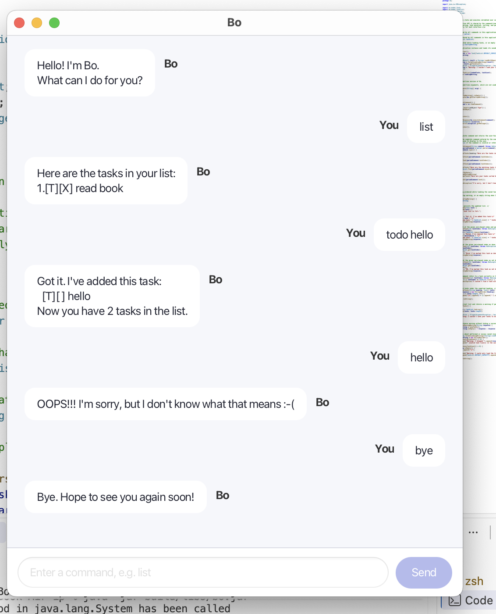

# Bo User Guide

Bo is a friendly command-line task manager for keeping track of todos,
deadlines, and events.



## Launching Bo

Build the executable JAR from the project root with Java 25:

```bash
./gradlew shadowJar
java -jar build/libs/bo.jar
```

On Windows, use `gradlew.bat shadowJar` and
`java -jar build\\libs\\bo.jar`.

Type one command per line. Tasks are saved automatically after changes and
loaded again when Bo starts. Type `bye` to exit.

## Managing tasks

| Command | Purpose | Example |
| --- | --- | --- |
| `todo DESCRIPTION` | Add a task without a date. | `todo read book` |
| `deadline DESCRIPTION /by DATE_OR_TIME` | Add a task with a deadline. | `deadline submit report /by 2026-10-15` |
| `event DESCRIPTION /from START /to END` | Add an event with a start and end. | `event project sync /from 2026-10-15 0900 /to 2026-10-15 1000` |
| `list` | Display all tasks and their numbers. | `list` |
| `mark NUMBER` | Mark a task as done. | `mark 1` |
| `unmark NUMBER` | Mark a task as not done. | `unmark 1` |
| `delete NUMBER` | Delete a task. | `delete 1` |
| `find KEYWORD` | Find tasks whose descriptions contain a keyword, ignoring case. | `find report` |
| `sort` | Sort dated tasks chronologically and place undated tasks last. | `sort` |

Task numbers are one-based, so the first task is task `1`.

## Date and time formats

Bo accepts these structured formats:

- Dates: `YYYY-MM-DD` or `D/M/YYYY`, such as `2026-10-15` or `15/10/2026`.
- Date-times: `D/M/YYYY HHmm`, `YYYY-MM-DD HHmm`,
  `YYYY-MM-DD HH:mm`, or ISO local date-time notation, such as
  `15/10/2026 0900` or `2026-10-15T09:00:00`.

Date-only values are displayed as dates; date-times include the time. Bo also
keeps older free-form values such as `Friday` readable for compatibility.
Structured dates and times must be real values, and an event must start before
it ends.

## Errors and recovery

Bo accepts harmless leading, trailing, and repeated spaces. Missing arguments,
unknown commands, duplicate date parameters, invalid task numbers, impossible
dates, and reversed event ranges produce a clear error message and leave the
application running. Missing, unreadable, or malformed saved data is reported
with a warning; valid records can still be loaded when possible.
